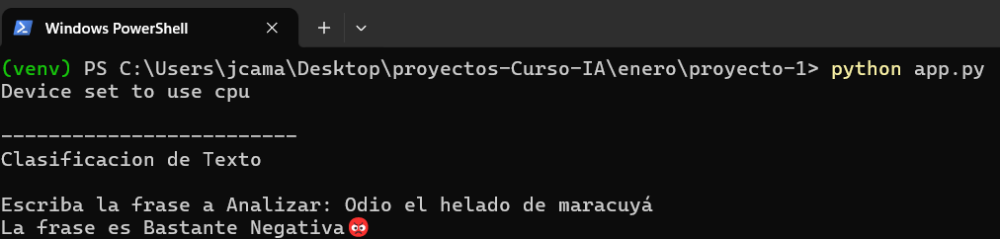
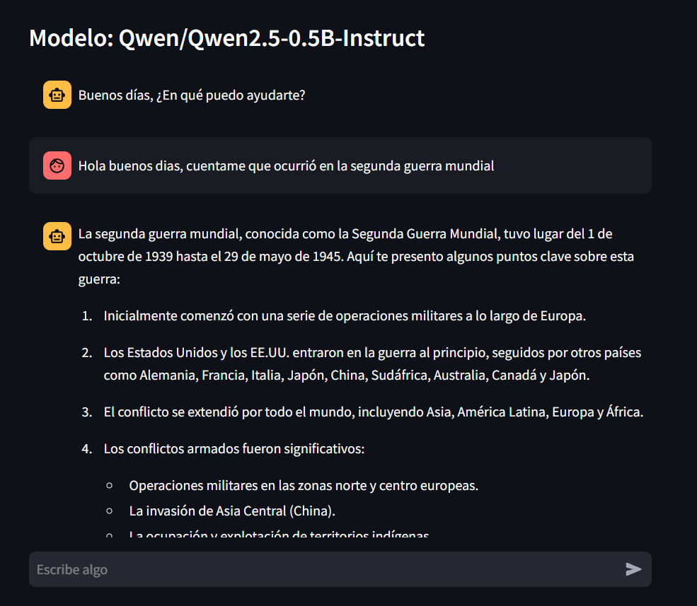
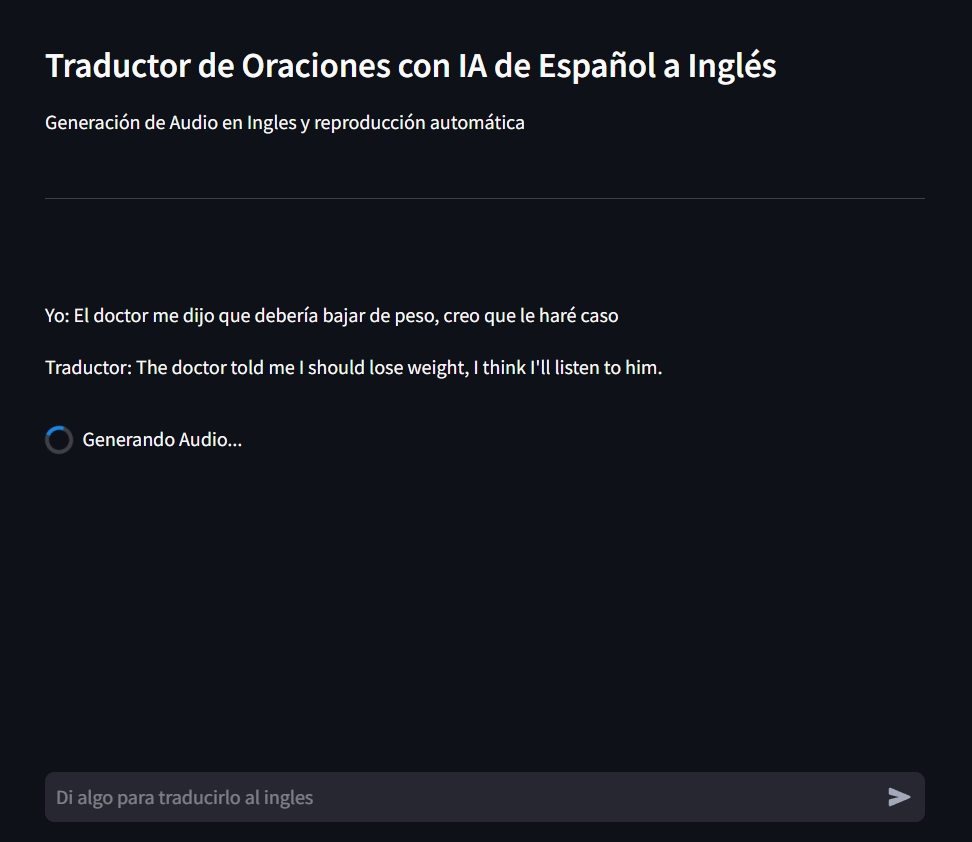

# Mini-Proyectos usando modelos de IA con transformers 🤖

##### Proyecto 1.

##### Proyecto 2.

##### Proyecto 3.

## Descripción

Tres Mini-Proyectos donde se usan algunos modelos de IA con la biblioteca de `transformers`, ya sea para analizar sentimiento a una oración, para un chatbot con una IA, o para un traductor que reproduzca el audio y el texto traducido

---

### Requisitos Previos

- **Python**
  Tener instalado `Python` en su versión `3.11.9`

- **Git** _(opcional)_
  Tener instalado `Git` para la clonación del proyecto

---

## Instalación y Uso

Para instalar y usar el proyecto deseado dirijase a las respectivas documentaciones

##### Documentaciones

- ##### Proyecto 1.

  [Documentación del Proyecto 1](./proyecto-1/README.md)

- ##### Proyecto 2.

  [Documentación del Proyecto 2](./proyecto-2/README.md)

- ##### Proyecto 3.

  [Documentación del Proyecto 3](./proyecto-3/README.md)

---

## Créditos

- **Autor:** Julian Alejandro Camacho Mendoza
- **Contacto:**
  - **Correo:** julandro.mza@gmail
  - **Cel:** 323 2304966
  - **GitHub:** [julandro](https://github.com/julandro)
