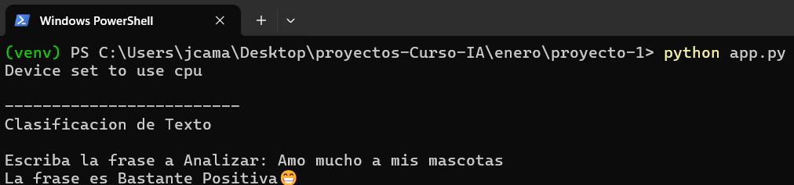
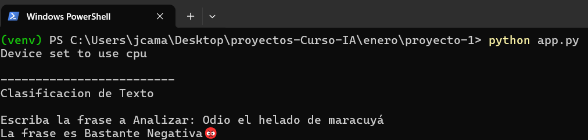
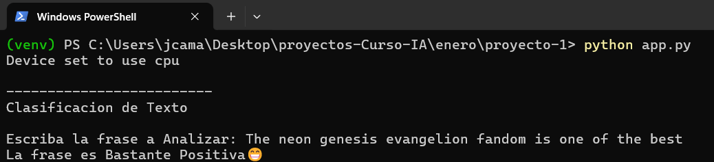
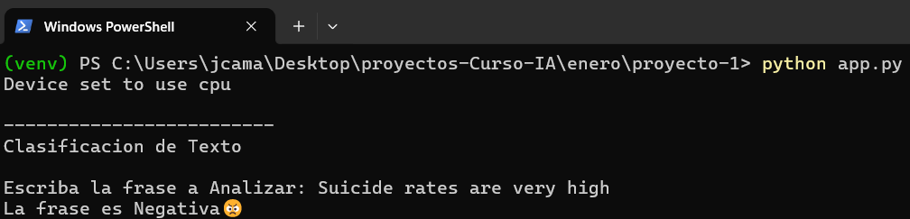

# Ejecución Modelo de IA de Detección de Sentimiento en Local

#### Vista Previa


## Descripción

Este proyecto sencillo ejecuta un modelo de IA, especificamente el `nlptown/bert-base-multilingual-uncased-sentiment` para detectar sentimiento en cualquiera de los idiomas mencionados en la tabla de abajo como un numero de estrellas del 1 al 5

|  Idioma  | Precisión (exacta) | Presición (off-by-1) |
| :------: | :----------------: | :------------------: |
| Español  |        58%         |         95%          |
|  Inglés  |        67%         |         95%          |
| Frances  |        59%         |         94%          |
|  Alemán  |        61%         |         94%          |
| Italiano |        59%         |         95%          |
| Holandés |        57%         |         93%          |

#### Precisión

- **La precisión (exacta)** es la coincidencia exacta del número de estrellas.
- **La precisión (con diferencia de 1)** es el porcentaje de reseñas en las que el número de estrellas que predice el modelo difiere como máximo en 1 del número dado por el revisor humano.

---

## Tabla de Contenidos

- [Requisitos](#requisitos)
- [Instalación](#instalación)
- [Uso](#uso)
- [Transformers](#transformers)
- [Créditos](#créditos)
- [Recursos y Enlaces Adicionales](#recursos-y-enlaces-adicionales)

---

### Requisitos

- **Python**
  Tener instalado `Python` en su versión `3.11.9`

- **Git** _(opcional)_
  Tener instalado `Git` para la clonación del proyecto

---

## Instalación

Sigue los pasos a continuación para configurar el proyecto en tu entorno local:

1. **Clona el repositorio:**
   ```bash
   git clone https://github.com/julandro/Aplicacion-Lista-de-Tareas-con-Python.git
   ```
2. **Navega al directorio del proyecto:**
   ```bash
   cd proyecto
   ```
3. **Crea y Activa un entorno virtual:**

   - Con `python` en la terminal:

     ```bash
     python -m venv .venv
     ```

   - Luego `Activalo`:

     ```bash
     .venv/Scripts/activate
     ```

4. **Instala las dependencias o modulos del proyecto:**
   - Con `pip`:
     ```bash
     pip install -r requeriments.txt
     ```

---

## Uso

Una vez instalado y estando en el entorno virtual puedes ejecutar el proyecto:

- **Ejecución:**
  ```bash
  python app.py
  ```

---

### Ejemplos de Uso

#### Ejemplo de uso en Español

##### Positivo



##### Negativo



#### Ejemplo de uso en Inglés

##### Positivo



##### Negativo



---

## Transformers y Ejecución de Modelos en Local

En esta sección se basa en mis conocimientos

### Transformers

Es una herramienta poderosa para trabajar con modelos NLP pre-entrenados. Desde los casos de uso más básicos hasta las tareas más avanzadas, ofrece soluciones que pueden ser adaptadas según tus necesidades. Desde la carga y ejecución de modelos predeterminados hasta el fine-tuning personalizado, la biblioteca te proporciona las herramientas para llevar tus proyectos de NLP al siguiente nivel.

**Librería de Transformers**

La biblioteca de transformers está dividida en varias capas, cada una enfocada en diferentes aspectos del procesamiento del lenguaje. Aquí te presento algunos de los módulos principales:

- **Pre-trained Models:** Estos son modelos que ya están entrenados para tareas específicas como clasificación de textos, generación de texto, etc.

- **Tokenizer:** Son funciones que convierten textos en secuencias numéricas que los modelos pueden procesar.

- **Dataset:** Son colecciones de datos que se pueden manipular y usar con transformers.

- **Pipeline:** Es una interfaz conveniente para ejecutar tareas comunes de lenguaje como análisis de sentimientos, generación automática, etc.

- **ModelCard:** Contiene información sobre el modelo, como su descripción, los datos que usó y cómo se entrenó.

#### Instalación y Uso Básico

**Instalación:**

```
pip install transformers
```

---

## Créditos

- **Autor:** Julian Alejandro Camacho Mendoza
- **Contacto:**
  - **Correo:** julandro.mza@gmail
  - **Cel:** 323 2304966
  - **GitHub:** [julandro](https://github.com/julandro)

---

## Recursos y Enlaces Adicionales

- [Documentación del Modelo de IA Usado](https://docs.streamlit.io/)
