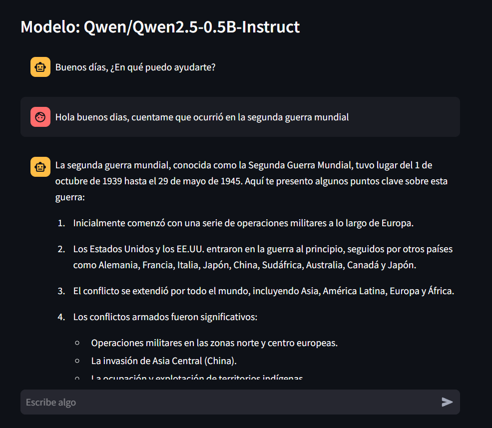
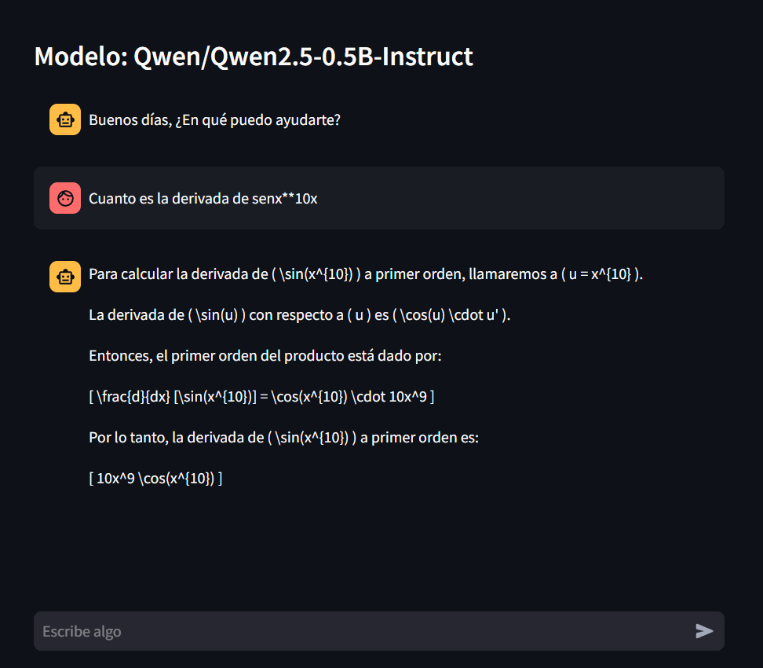

# IA Chat

#### Vista Previa



## Descripción

Este proyecto es una aplicativo de Chat con una IA usando el modelo `Qwen/Qwen2.5-0.5B-Instruct`. Es un modelo de generación de texto bastante liviano y útil para este tipo de proyectos

---

## Tabla de Contenidos

- [Instalación](#instalación)
- [Uso](#uso)
- [Créditos](#créditos)
- [Recursos y Enlaces Adicionales](#recursos-y-enlaces-adicionales)

---

### Requisitos Previos

- **Python**
  Tener instalado `Python` en su versión `3.11.9`

- **Git** _(opcional)_
  Tener instalado `Git` para la clonación del proyecto

---

## Instalación

Sigue los pasos a continuación para configurar el proyecto en tu entorno local:

1. **Clona el repositorio:**
   ```bash
   git clone https://github.com/julandro/Mini-Proyectos-usando-IA.git
   ```
2. **Navega al directorio del proyecto:**
   ```bash
   cd proyecto-2
   ```
3. **Crea y Activa un entorno virtual:**

   - Con `python` en la terminal:

     ```bash
     python -m venv venv
     ```

   - Luego `Activalo`:

     ```bash
     venv/Scripts/activate
     ```

4. **Instala las dependencias o modulos del proyecto:**
   - Con `pip`:
     ```bash
     pip install -r requeriments.txt
     ```

---

## Uso

Una vez instalado y estando en el entorno virtual puedes ejecutar el proyecto:

- **Ejecución:**
  ```bash
  streamlit run ./app.py
  ```
  Esto ejecutará la aplicación de Streamlit en tu navegador.

### Ejemplos de Uso





---

## Créditos

- **Autor:** Julian Alejandro Camacho Mendoza
- **Contacto:**
  - **Correo:** julandro.mza@gmail
  - **Cel:** 323 2304966
  - **GitHub:** [julandro](https://github.com/julandro)

---

## Recursos y Enlaces Adicionales

- [Streamlit Documentacion](https://docs.streamlit.io/)
- [Documentación del Modelo `Qwen/Qwen2.5-0.5B-Instruct`](https://huggingface.co/Qwen/Qwen2.5-0.5B-Instruct)
