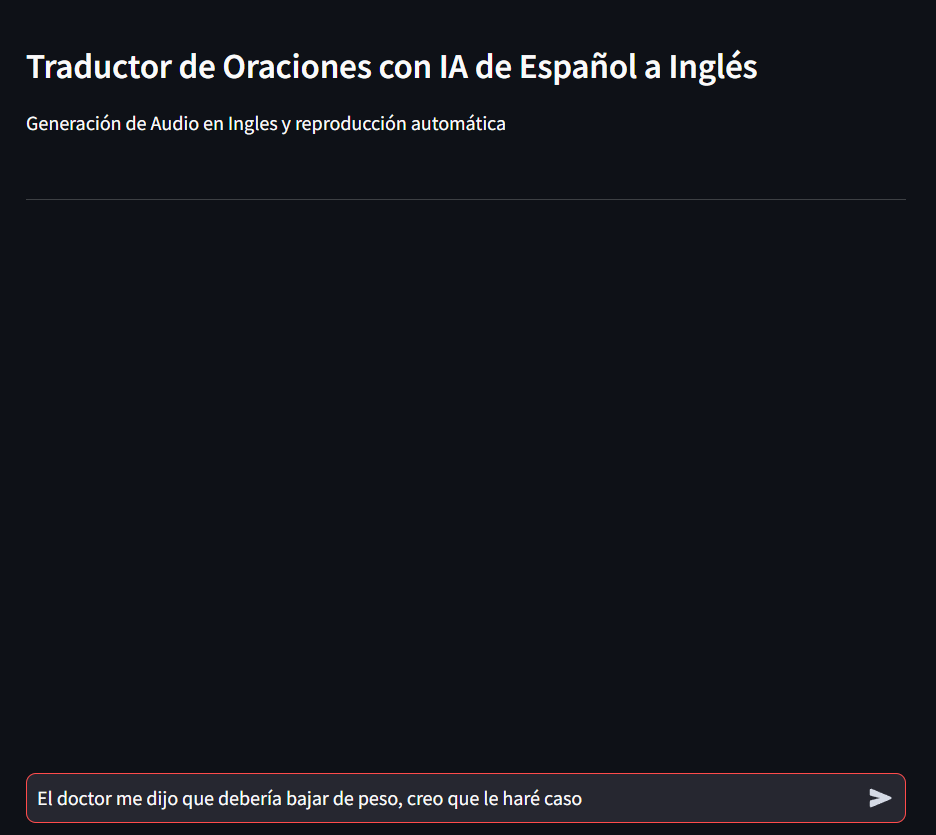
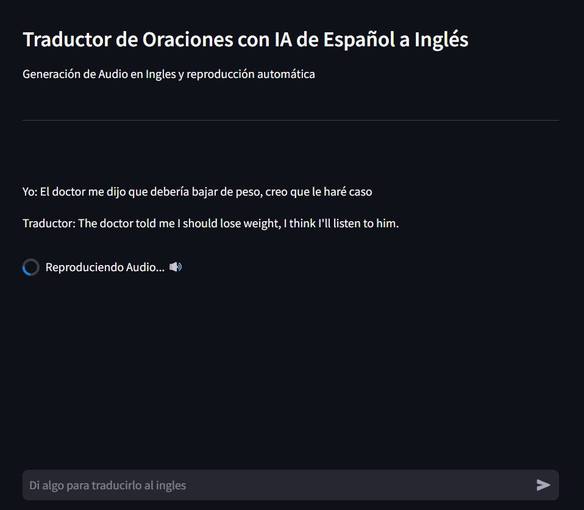
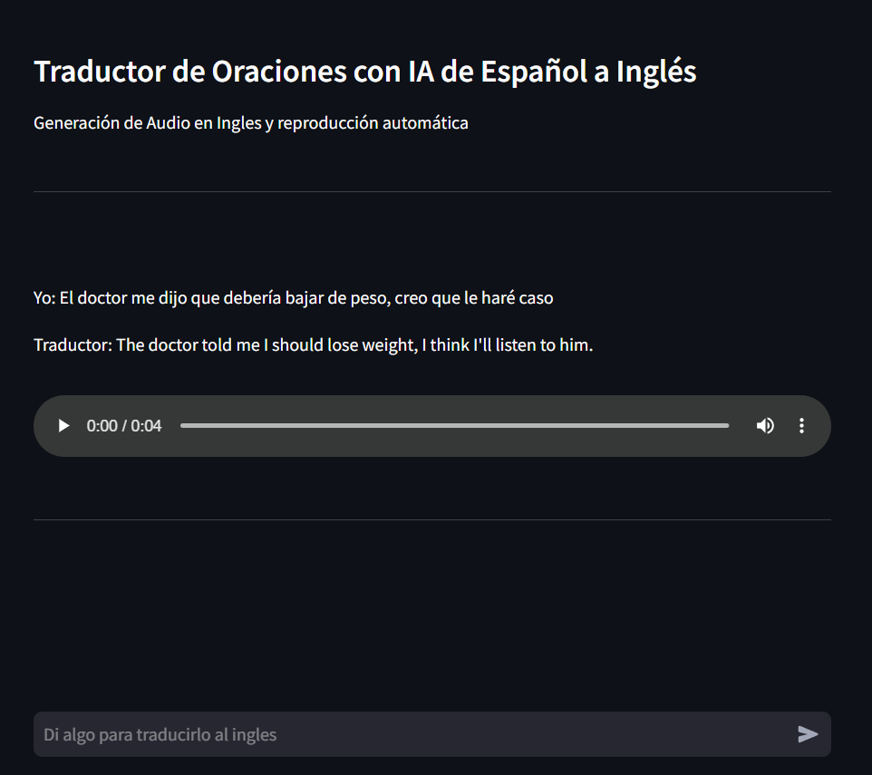

# Traductor de Oraciones con IA de Español a Inglés con Generación de Audio

#### Vista Previa


## Descripción

Este proyecto es una aplicación que le permite al usuario **traducir** un texto de **español a ingles** y genera el audio en inglés que se reproducirá automáticamente.

---

## Tabla de Contenidos

- [Instalación](#instalación)
- [Uso](#uso)
- [Características](#características)
- [Créditos](#créditos)
- [Recursos y Enlaces Adicionales](#recursos-y-enlaces-adicionales)

---

### Requisitos Previos

- **Python**
  Tener instalado `Python` en su versión `3.11.9`

- **Git** _(opcional)_
  Tener instalado `Git` para la clonación del proyecto

---

## Instalación

Sigue los pasos a continuación para configurar el proyecto en tu entorno local:

1. **Clona el repositorio:**
   ```bash
   git clone https://github.com/julandro/Mini-Proyectos-usando-IA.git
   ```
2. **Navega al directorio del proyecto:**
   ```bash
   cd proyecto-3
   ```
3. **Crea y Activa un entorno virtual:**

   - Con `python` en la terminal:

     ```bash
     python -m venv venv
     ```

   - Luego `Activalo`:

     ```bash
     venv/Scripts/activate
     ```

4. **Instala las dependencias o modulos del proyecto:**
   - Con `pip`:
     ```bash
     pip install -r requeriments.txt
     ```

---

## Uso

Una vez instalado y estando en el entorno virtual puedes ejecutar el proyecto:

- **Ejecución:**
  ```bash
  streamlit run ./app.py
  ```

### Ejemplos de Uso






## Características

#### Características generales

- **[Traducción Español-Inglés]:** Traduce a Inglés, el prompt que le pasemos en Español. Esto gracias al modelo `Helsinki-NLP/opus-mt-es-en`
- **[Generación de Discursos]:** Genera discursos en inglés, a partir de la traducción ya realizada. Esto gracias al modelo `facebook/mms-tts-eng`
- **[Reproducción Automática del Audio]:** Reproduce Automáticamente el audio

#### Iteración de un Modelo de IA a Otro

- **[Modelo de Traducción]:** `Helsinki-NLP/opus-mt-es-en`, es un modelo de traducción de Español a Inglés.
  Se traduce usando este modelo usando su resuesta en el front y para retornarla al siguiente modelo
- **[Modelo 'Text-to-Speech']:** `facebook/mms-tts-eng`, es un modelo que genera 'discursos' en ingles.
  Se le pasa la traducción a este modelo y se encarga de crear el audio

---

## Créditos

- **Autor:** Julian Alejandro Camacho Mendoza
- **Contacto:**
  - **Correo:** julandro.mza@gmail
  - **Cel:** 323 2304966
  - **GitHub:** [julandro](https://github.com/julandro)

---

## Recursos y Enlaces Adicionales

- [Streamlit Documentacion](https://docs.streamlit.io/)
- [Documentación del Modelo `Helsinki-NLP/opus-mt-es-en`](https://huggingface.co/Helsinki-NLP/opus-mt-es-en)
- [Documentación del Modelo `facebook/mms-tts-eng`](https://huggingface.co/facebook/mms-tts-eng)
